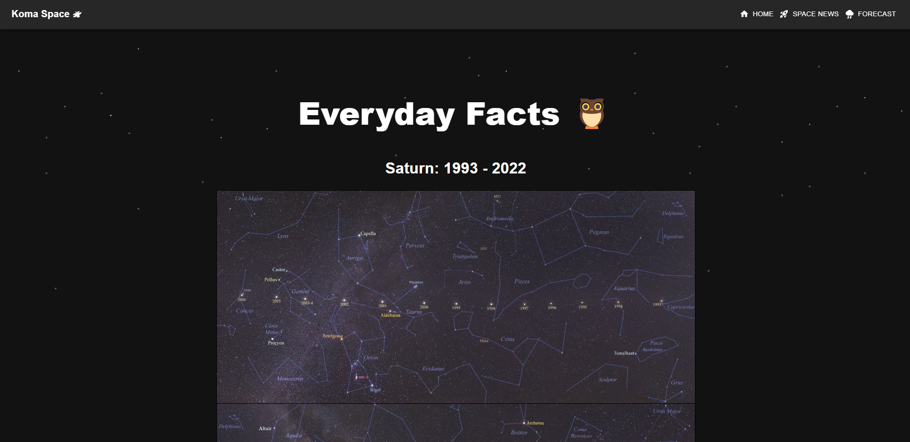
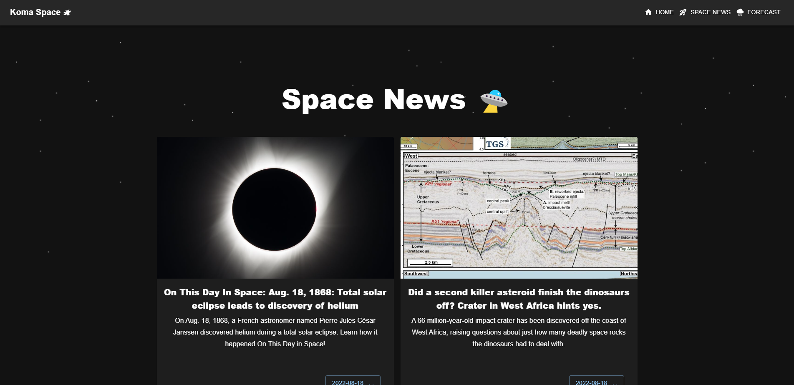
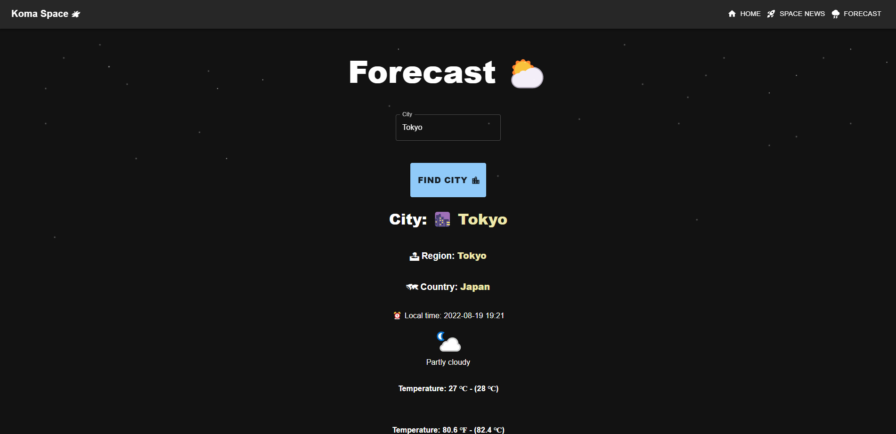
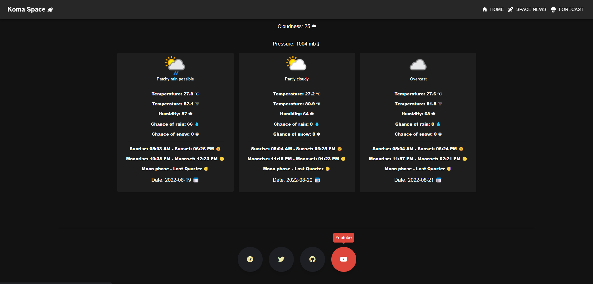

<h1 align='center'>Space - Koma 🦉</h1>
<h3 align='center'>Web application with three different API: SpaceNews, Daily Facts about Space and Forecast with some simple styling 🛸</h3>
 

 

<h2 align='center'> Screenshots:</h2>

Demo in github description

API
<ul>
<li>https://rapidapi.com/weatherapi/api/weatherapi-com/
<li>https://rapidapi.com/neron244-B3Tc6nyYpKS/api/space-news/
<li>https://rapidapi.com/koukoulina001/api/astronomy-picture-of-the-day/
</ul>

TODO
<ul>
<li><strike>Record video about forecast mapping?
<li><strike>Daily facts about space API
<li><strike>Forecast mapping 

</ul>